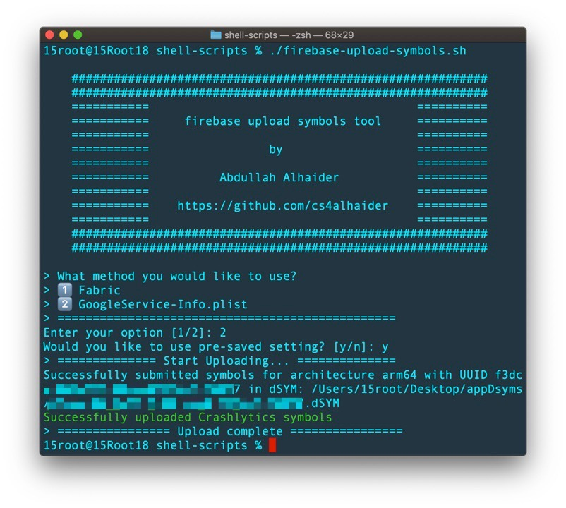

# firebase-upload-symbols
Upload symbols tool to upload dSYMs files to Firebase for processing

---
#### Note, if you wish to build a macOS app to have a GUI, you can achieve that by using [Scriptable](https://github.com/cs4alhaider/Scriptable).
---

| Example Terminal window |
| --- |
|  |


## Before using

If you want to use pre-saved settings, make sure to change those values in `firebase-upload-symbols.sh` file 
```shell
# Change path to dSYM folder
SAVED_dSYM_FOLDER="/Users/..../appDsyms" 

# for example: 652ac70afbbde134719v4as01415fa9793da901f
SAVED_FABRIC_API_KEY="HERE_YOU_NEED_TO_ADD_FABRIC_API_KEY_IF_YOU_USE_FABRIC" 

# Change path to Fabric upload script for your project
SAVED_UPLOAD_SCRIPT="/Users/..../Pods/Fabric/upload-symbols"

# Change path to Google services info for your project
SAVED_GOOGLE_CONFIG="/Users/.../GoogleService-Info.plist" 
```


## Author

Abdullah Alhaider [Twitter](https://twitter.com/cs4alhaider). 


## License

This project is under the MIT license. See the LICENSE file for more info.
